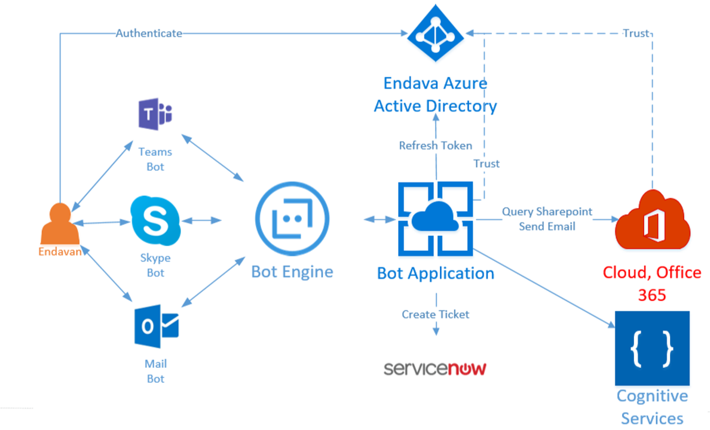
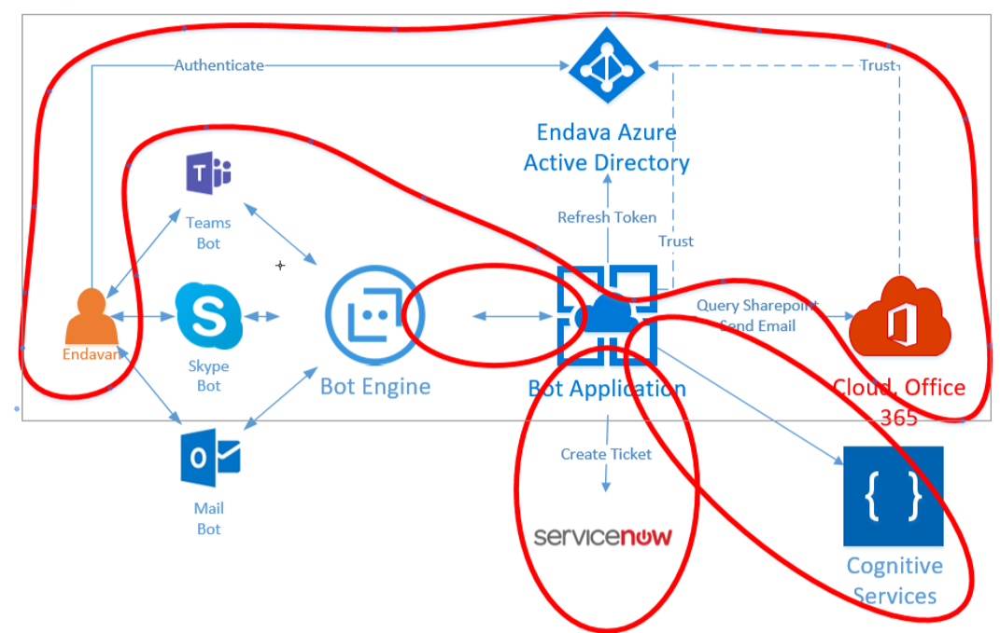
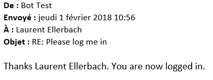
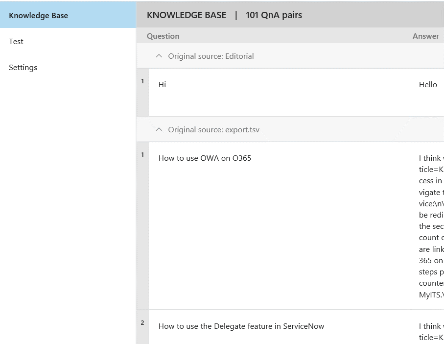

# Introduction 
This project has been build during an internal HackFest between [Endava](http://www.endava.com/en/) and Microsoft. The Hackfest was split between Cluj and Bucharest, both cities in Romania. Main focus was to prototype AI features to enhance Endava IT support web app, like using  natural language dialogs with Chat Bots, Machine Learning to optimize ticket handling. The HackFest took place between 30th of January 2018 and 2nd of February 2018. 
This GitHub will describe part of the work realized during the 3 days in Cluj.
The coding team included:
* [Corina Ciocanea](https://github.com/CorinaCiocanea), Developer (Endava)
* [Alexandru Marchis](https://github.com/alexmarchis), Developer (Endava)
* [Tudor Muresan](https://github.com/IoBebe), Developer (Endava)
* Laurent Ellerbach, Technical Evangelist Lead (Microsoft)

You'll find the follwing sections in this document:
- [Project Description](./README.md#project-description)
- [Technologies used](./README.md#technologies-used)
- [Authentication](./README.md#authentication)
    - [Setting up keys, ID to access all services](./README.md#setting-up-keys-id-to-access-all-services)
        - [AAD setup](./README.md#aad-setup)
        - [Bot setup](./README.md#bot-setup)
        - [Q&A Maker setup](./README.md#qa-maker-setup)
        - [LUIS setup](./README.md#luis-setup)
    - [Handling the authentication in the code](./README.md#handling-the-authentication-in-the-code)
        - [AAD authentication](./README.md#aad-authentication)
        - [Bot authentication](./README.md#bot-authentication)
        - [Q&A Maker authentication](./README.md#qa-maker-authentication)
        - [LUIS services authentication](./README.md#luis-services-authentication)
- [The mail channel](./README.md#the-mail-channel)
- [Microsoft Graph and SharePoint](./README.md#microsoft-graph-and-sharepoint)
- [Q&A Maker tips and trick](./README.md#qa-maker-tips-and-trick)
- [LUIS Service tips and tricks](./README.md#luis-service-tips-and-tricks)
- [Conclusion and next steps](./README.md#conclusion-and-next-steps)

# Project Description
The team in Cluj focused mainly on building an efficient Chat Bot with multiple purpose:
* Create direct request into the Endava ticket management system with a smooth user experience
* As a proof of concept, create a SharePoint request access Chat Bot using Microsoft Graph, with sending a mail directly to the SharePoint owner or creating a ticket request in their specific application called Service Now
* Use Q&A Maker to answer user questions based on actual real Endava Q&A pages
* Have everything authenticated with the Endava Active Directory integration
* Have everything working with email as well as historically most of the users are using email to create ticket request

What will be described in this document:
* How to managed the authentication for the bot using any channel including email
* How to include Q&A Maker into a bot, we will not describe how to create a Q&A Maker bot
* Using Microsoft Graph with SharePoint and sending Email
So the actual code is an extract of a more complex solution developed in the 3 days.

The overall architecture looks like:



# Technologies used
The code present in this solution is using the following technologies:
* [Q&A Maker](https://qnamaker.ai/)
* [Microsoft Bot Framework](https://dev.botframework.com/)
* [Microsoft Graph](https://developer.microsoft.com/en-us/graph/)
* [Azure Active Directory](https://azure.microsoft.com/en-us/services/active-directory/)
* [LUIS.ai](http://luis.ai) is cognitive service for text recognition which allow to analyze sentences
* All services are hosted in [Microsoft Azure](https://azure.microsoft.com/), the bot code as a Web app
* All the code has been produced in C# using [Visual Studio Enterprise and VSTS](https://www.visualstudio.com) as a code repository

# Authentication
The Authentication was necessary as idea is to have the user context in the bot to identify specific user information like the SharePoint sites, sending a mail as well as making sure the bot is secured and being able to be access only by employees.
This include few challenges like the fact the bot has to support email so the bot has to support authentication for the user and not having its own authentication. 
The Endava Azure Active Directory is a v1 AAD. So we’ve used the AAD 1 example as a base for the main bot.
Few things to consider if you want to add authentication:
* Use the AuthBot example, make sure you keep the mechanism with the code to copy/paste. This is important for security reasons. As the Chat Bot is in a different context as your browser, it’s the way to avoid some attack vectors.
* Setup your AAD to authorize the specific app, you’ll get a client ID and a secret that you’ll have to place correctly in the web.config file
* Make sure you have the correct return URL setup in the app config as well, you can put multiple ones like for debug and production, they all have to match exactly the redirect URL, so full path including the https/http is required
* Make sure you’ll give the right authorization in the AAD setup of the app for specific roles like Sites.Read.All, Mail.ReadWrite, User.Read, People.Read, Directory.AccessAsUser.All

The authentication, security and authorization in the all up project looks like the following:



As you’ll see the main context is driven by the AAD authentication. 
On top of AAD, we have the following mechanism in place:
* The internal Service Now which we will not cover here
* The bot engine with the web app, this is use classical client ID and Key
* The bot itself and the LUIS cognitive services, this is use classical client ID and Key
* The bot itself and the Q&A Maker service, this is use classical client ID and Key

## Setting up keys, ID to access all services
### AAD setup
From the code site, now you’ve setup everything, you need to place the right values in the web.config:
* The Tenant is basically your domain name for AAD, it can be yourdomain.com or yourdomain.onmicrosoft.com, depending how it is setup
* The ClientId and ClientSecret, you’ll get from the setup of the app
* the RedirectURL is the URL you’ll deploy the bot. In the example, it’s the local host. For production, the URL will be different. Again, you can setup multiple URL in the app setup, do it for all your possible cases

```XML
    <!-- AAD Auth v1 settings -->
    <add key="ActiveDirectory.Mode" value="v1" />
    <add key="ActiveDirectory.ResourceId" value="https://graph.microsoft.com/" />    
    <add key="ActiveDirectory.EndpointUrl" value="https://login.microsoftonline.com" />
    <add key="ActiveDirectory.Tenant" value="YOUR_DOMAIN.COM" />
    <add key="ActiveDirectory.ClientId" value="client_ID" />
    <add key="ActiveDirectory.ClientSecret" value="super_secret" />
    <add key="ActiveDirectory.RedirectUrl" value="http://localhost:3979/api/OAuthCallback" />
```

All those setups are sometimes a bit tricky and the error message you’ll get for the authentication will always give you a good hint on what to look at. They are quite explicit and can help you solve the issues. All up, this part is always a bit tricky to setup, it may require as well the domain administrator to give you specific permissions. Never under estimate the time it can take to set it up. The good news is that once it’s done and working, it’s done and working :-)

### Bot setup
When you [create and register your bot](https://dev.botframework.com/), you create a bot name, client ID and Key. Use those and place them in this section of the web.config:
```XML
    <add key="BotId" value="YourBotId" />
    <add key="MicrosoftAppId" value="" />
    <add key="MicrosoftAppPassword" value="" />
```

### Q&A Maker setup
When you create a [Q&A Maker](https://qnamaker.ai/), you’ll get as well an ID and a Key, they’re necessary as well to access the service and ask for recommendation. Fill the web.config as well with the right keys:
```XML
    <!--QnaMaker settings-->
    <add key="QnaMaker.KbId" value="QAMaker_ID" />
    <add key="QnaMaker.KbKey" value="QAMaker_Key" />
```

### LUIS setup
[LUIS](http://luis.ai) is used in the SharePoint Dialog to extract the URL or the name of the SharePoint to access as well as the type of access. Like almost all services, when you’ll create the service and set it up, you’ll get an ID and a secret. 
You need to decorate the main dialog with the LUIS attribute:
```C#
    [LuisModel("Key-with-dash", "secret")]
    public class SpDialog : LuisDialog<object>
```

## Handling the authentication in the code
From the code perspective, each authentication is handle a bit differently. The main one is the AAD one where we’ll get the token that will be used to access Microsoft Graph.
### AAD authentication
The mechanism used follow the schema:


Most of the code is present in the AuthBot part. As already explained previously, it is important to keep the copy/paste of the code to avoid vectors attacks. Keep in mind that this token is very important as it does contains the credentials necessary to access lots of information including in our case sending email from his own inbox. So never try to make security simpler, always keep it as a first priority.

The AAD authentication works as well with email. Note that to test the email authentication, you can only do it with the bot running in the production environment. Emails are pulled from an Office 365 account and processed every minutes approximately. The user experience is similar with email as with any other channel. You connect to the bot by sending an email, it does answer you to login and you have to send back the code. The core code from the AuthBot has been modify to make the experience smoother, reducing the number of email sent as well as extracting the code more easily.

Once you’ve sent a mail to the bot, it will sent you back a mail asking to click to get authenticated and you’ll sent back the code:


Once sent, the bot will answer you that you’re authenticated. Based on the internal flow of the bot, all the other message you’ll send will be processed under your context. And as with Teams or any other channel, you’ll be able to do exactly the same. Still, the email channel is specific and you’ll want to limit what you’re sending to the user and take more assumptions. We’ll discuss this in the further sections.



For more information regarding the AuthBot, please refer to the [GitHub page](https://github.com/MicrosoftDX/AuthBot) directly. 

### Bot authentication
The bot authentication is directly managed in the bot SDK. By decorating your main controller with the BotAuthentication attribute, you put in place the mechanism with the key and the secret mentioned in the setup of the previous section. It is fully transparent and if you do the right copy/paste for those 2 elements in the web.config file, it will work like a charm. Even in debug mode, you’ll need the Id and the secret. The emulator does support it and it’s perfect to test if your pair is working.
```C#
namespace BotToQuerySharepoint
{
    [BotAuthentication]
    public class MessagesController : ApiController
    {
        /// <summary>
        /// POST: api/Messages
        /// Receive a message from a user and reply to it
        /// </summary>
        [BotAuthentication]
        public async Task<HttpResponseMessage> Post([FromBody]Activity activity)
        {
            //code here
        }
    }
}
```
### Q&A Maker authentication
The keys are used to call the REST API. The usage is quite simple and straight forward. Here is an extract of the code:

```C#
public virtual async Task MessageReceivedAsync(IDialogContext context, IAwaitable<IMessageActivity> item)
{
    var message = await item;
    {
        string kbId = ConfigurationManager.AppSettings["QnaMaker.KbId"];
        string kbKey = ConfigurationManager.AppSettings["QnaMaker.KbKey"];
        string qnaUrl =
            $"https://westus.api.cognitive.microsoft.com/qnamaker/v2.0/knowledgebases/{kbId}/generateAnswer";
        HttpClient client = new HttpClient();        
        var json = new
        {
            question = strtosend,
            top = 3
        };
        var content = new StringContent(JsonConvert.SerializeObject(json), Encoding.UTF8, "application/json");
        content.Headers.Add("Ocp-Apim-Subscription-Key", kbKey);
        HttpResponseMessage response = await client.PostAsync(qnaUrl, content);
        if (response.StatusCode == HttpStatusCode.OK)
        {
            //do what needs to be done to select the answer and propose it
        }
    }
}
```
The API is very simple and [documented here](https://westus.dev.cognitive.microsoft.com/docs/services/58994a073d9e04097c7ba6fe/operations/58994a073d9e041ad42d9baa). We're only using one of the API which will return 3 possible answers maximum for a specific question. 

### LUIS services authentication
As explained in the previous section, the authentication is done directly with the decoration of the class. It is fully transparent. 

# The mail channel
As already mentioned, the mail channel is a bit specific like the SMS would be as well. In both cases, you’ll want to reduce the number of exchange in those channels. That’s what we’ve done by adjusting a bit the authentication flow to reduce the number of emails as well as extracting the code from the rest of the mail. 

The main difference with other channels is that the user will most of the time answer the email rather than removing everything before writing. You’ll have as well the signature of the user and other elements like this. So this channel require extra work like cleaning those elements.
As an example, here is a code extract from the AzureAuthDialog from the AuthBot: 
```C#
if (msg.Text == null)
{
    if (msg.ChannelId != "email")
    {
        await context.PostAsync($"Please paste back the number you received in your authentication screen.");
    }
    context.Wait(this.MessageReceivedAsync);

}
else
{
    //This is added as wome channels add elements like emails or copy/paste in Teams
    string cleanedText = msg.Text;
    Match firstmatchedValue = Regex.Match(msg.Text, @"\d+", RegexOptions.IgnorePatternWhitespace);
    if (firstmatchedValue.Length > 0)
        cleanedText = firstmatchedValue.Value;

    if (cleanedText.Length >= 6 && magicNumber.ToString() == cleanedText.Substring(0, 6))
    {
        context.UserData.SetValue<string>(ContextConstants.MagicNumberValidated, "true");
        context.Done($"Thanks {authResult.UserName}. You are now logged in. ");
    }
    else
    {
        context.UserData.RemoveValue(ContextConstants.AuthResultKey);
        context.UserData.SetValue<string>(ContextConstants.MagicNumberValidated, "false");
        context.UserData.RemoveValue(ContextConstants.MagicNumberKey);
        await context.PostAsync($"I'm sorry but I couldn't validate your number. Please try authenticating once again. ");
        context.Wait(this.MessageReceivedAsync);
    }
}
```
To reduce the amount of email sent to the user, we're just not telling him to paste back the authentication code but we rather write it in the webpage and asking the user to reply to the mail. You can find the different information asked to the user in the OAuthCallbackController from the authBot:
```C#
await Conversation.ResumeAsync(resumptionCookie, message);
if (message.ChannelId == "skypeforbusiness")
    resp.Content = new StringContent($"<html><body>Almost done! Please copy this number and paste it back to your chat so your authentication can complete:<br/> {magicNumber} </body></html>", System.Text.Encoding.UTF8, @"text/html");
else if (message.ChannelId == "email")
    resp.Content = new StringContent($"<html><body>Almost done! Please reply to the email you've received asking you to authenticate with this number so your authentication can complete:<br/> {magicNumber} </body></html>", System.Text.Encoding.UTF8, @"text/html");
else
    resp.Content = new StringContent($"<html><body>Almost done! Please copy this number and paste it back to your chat so your authentication can complete:<br/> <h1>{magicNumber}</h1>.</body></html>", System.Text.Encoding.UTF8, @"text/html");
``` 
Every channel can be identify with its name. It's the best way to split the behavior of your bot depending of the channel.

Other example is located in the Q&A Dialog (kbDialog) from the main bot:
```C#
string strtosend = message.Text;
if (message.ChannelId == "email")
{
    var str = strtosend.Split('\n');
    int maxidx = str.Length;
    if (maxidx > 3)
        maxidx = 4;
    for (int i = 0; i < maxidx; i++)
        strtosend += str[i] + " ";
}
```
The idea here is to extract only the first part of the email removing the signature. The assumption is that only the first 3 lines will contain the possible question. The rest is the rest of the conversation or the user signature. It's an assumption, it's not perfect but it worked perfectly in our 3 days of hackfest.

Another example in the Q&A Maker code is how to handle the return of a question. The normal behavior is to give the user 3 options maximum and ask him which ones best fit its need. But if you're using email, you just expect to have the answer, not having to answer another email. The choice we've made is to return the first answer if the channel if the email one. Another option would have been to put the details of all answers in the mail. The code below demonstrate how it is handled:

```C#
if (qnaResponse.answers.Count == 0)
{
    await context.PostAsync(
        "I couldn't find any information on the topic. \nAnything else from the QNA section I can help you with ?");
    context.Done(true);
}
else if ((qnaResponse.answers.Count == 1) || (message.ChannelId == "email"))
{
    await context.PostAsync(qnaResponse.answers.First().answer);
    context.Done(true);
}
else
{
    //more code
}
```

# Microsoft Graph and SharePoint
[Microsoft Graph](https://developer.microsoft.com/en-us/graph/) is a unified REST API to access, modify, create a user related data like his calendar, email, SharePoint, OneDrive. In our case, we're interested in the SharePoint and Mail part of the Graph API. 

We've decided to use the Nuget package Microsoft.Grapth to make our life easier. The Nuget handle all the requests, the return objects. But you have to handle the authentication yourself and provide a token. The good news is that as you've read before, it's exactly what we managed to get during the authentication mechanism.

As an example, here is the function which  check get the owner name for a specific SharePoint subsite:
```C#
public async Task<UserInfo> GetOwnerNameForSite(string token, string siteId)
{
    var graphService = new GraphServiceClient(
        new DelegateAuthenticationProvider(
            (requestMessage) =>
            {
                requestMessage.Headers.Authorization = new AuthenticationHeaderValue("bearer", token);
                return Task.FromResult(0);
            }));

    var s = await graphService.Sites[siteId]
        .Drives.Request()
        .GetAsync();

    var user = await graphService.Users[s.First().CreatedBy.User.Id].Request().GetAsync();
    return new UserInfo()
    {
        EmailAddress = user.Mail,
        Name = user.DisplayName
    };
}
```
When creating the GraphServiceClient, you just have to pass the token as in the code and then you can call the Graph function that you're interested in.

All the returned elements are very easy to parse and make the usage quite straight forward. In our case, as we want to send a mail to the owner of a SharePoint, we grab the mail and the name. So we'll be able to display it to the user and send the mail as well.

Sending a mail using the Microsoft Graph is very easy and straight forward as well:
```C#
public async Task SendEmail(string accessToken, string emailAddress, string body, string subject)
{
    var message = new Message();
    message.Body = new ItemBody() { Content = body, ContentType = BodyType.Text };
    message.ToRecipients = new List<Recipient>()
    {
        new Recipient() {EmailAddress = new EmailAddress() {Address = emailAddress}}
    };
    message.Subject = subject;

    var graphserviceClient = new GraphServiceClient(
        new DelegateAuthenticationProvider(
            (requestMessage) =>
            {
                requestMessage.Headers.Authorization = new AuthenticationHeaderValue("bearer", accessToken);
                return Task.FromResult(0);
            }));

    await graphserviceClient.Me.SendMail(message, true).Request().PostAsync();
}   
```
Note that in our case, we're just sending a simple text mail, HTML is supported as well. Multiple recipients as well. Again, in our case and giving the fact we had only 3 days for the full solution, we've decided to make a working code but taking the simplest way possible.

In the case of the sending the mail, as the user is authenticated with his own credentials, the mail will be sent from his own inbox and he will find the mail in his sent items. 

You can play and test all the [Microsoft Graph features directly online](https://developer.microsoft.com/en-us/graph/graph-explore). You can authenticate with your own credential, test all the function, see the impact of the scope you can give or remove.  

# Q&A Maker tips and trick
Q&A Maker is a great tool to very quickly get a list of pair questions and answers and having a cognitive service where you can ask a question and get answers. The tool is really easy to use and to integrate. This service is still in preview and evolving. It looks like this:



To populate the list, you have multiple options. You can use the API [documented here](https://westus.dev.cognitive.microsoft.com/docs/services/58994a073d9e04097c7ba6fe/operations/58994a073d9e041ad42d9baa) or import a tsv file or provide a URL. 

Because Endava knowledge base requires authentication and the Q&A Maker does not, we had to export it. The way the data are stored include HTML code that we had to clean. 

We've used regex to clean the data, removing the HTML tags, inserting tabulations and carrier returns. Here is an extract of the code:
```C#
// remove all styles (prepare first by clearing attributes)
result = System.Text.RegularExpressions.Regex.Replace(result,
            @"<( )*style([^>])*>", "<style>",
            System.Text.RegularExpressions.RegexOptions.IgnoreCase);
result = System.Text.RegularExpressions.Regex.Replace(result,
            @"(<( )*(/)( )*style( )*>)", "</style>",
            System.Text.RegularExpressions.RegexOptions.IgnoreCase);
result = System.Text.RegularExpressions.Regex.Replace(result,
            "(<style>).*(</style>)", string.Empty,
            System.Text.RegularExpressions.RegexOptions.IgnoreCase);

// insert tabs in spaces of <td> tags
result = System.Text.RegularExpressions.Regex.Replace(result,
            @"<( )*td([^>])*>", "\\t", //\t
            System.Text.RegularExpressions.RegexOptions.IgnoreCase);
```
You'll note the ```"\\t"``` and you may wonder why not a simple ```"\t"```. The answer is the same for ```"\\n"```. It is related to the fact that the Q&A Maker stores the answers as raw text and will return it as raw text. The tsv file used can't contain any carrier return or additional tabulation if you don't want to break the file. All the channels know how to render the \t and\n and it will give some nicer formatting. Note as well that you can store Markdown in Q&A Maker but keep in mind the channels you want to target, some may not support it! And in the screen capture, you can see some of the \n

Other trick we've used is adding a link to the main KB page in all the answers. Reason is because those pages are nicer than the text one, can include images that we've fully removed from our main code. So we tried to make the best experience possible for the user.

Q&A Maker is using both the question text AND the answer to propose the right answers. So it's important to maximize the text in your answers as well. 

# LUIS Service tips and tricks 
Setting up a LUIS service is quite straight forward. In our example, we have only 1 intent and 3 entities. 

The way LUIS works is like the following:
* User request: I would like [read] access to the [Development] sharepoint site.
* LUIS will understand the intent: SharePoint access and will extract the two entities: [read] and [Development] 

To handle an intent and call a specific function from your LUIS dialog, just decorate the function with the name of your intent like in the following code:
```C#
[LuisIntent("sp-access")]
public virtual async Task ProcessSpAccessRequest(IDialogContext context, LuisResult luisResult)
{
    var accessToken =
        await context.GetAccessToken(
            ConfigurationManager.AppSettings[
                "ActiveDirectory.ResourceId"]); //assuming graph api is the resource
    SpFormHandler formHandler = new SpFormHandler();
    IFormDialog<SharepointModel> formDialog = formHandler.GetFormDialog(luisResult.Entities, accessToken);

    context.Call(formDialog, OnFormComplete);
}
```
Because the SharePoint bot is more like a linear dialog, we're directly brunching the LUIS dialog to a form dialog which makes the life easier when you want to ask linear questions. So most of the actual code of the SharePoint question is done in the SpFormHandler form. It's an elegant way to connect various dialogs. And as you'll see in the code, you can pass any object in the constructor:
```C#
[Serializable]
public class SpFormHandler
{
    public IFormDialog<SharepointModel> GetFormDialog(IEnumerable<EntityRecommendation> entities, string token)
    {
        var spForm = new SharepointModel();
        spForm.Token = token;
        foreach (EntityRecommendation entity in entities)
        {
            if (entity.Type == "sp-sitename" || entity.Type == "builtin.url")
            {
                spForm.SitenameOrUrl = entity.Entity;
            }

            if (entity.Type == "sp-accessright")
            {
                Enum.TryParse(entity.Entity, true, out AccessRights rights);
                spForm.AccessRights = rights;
            }
        }

        return new FormDialog<SharepointModel>(spForm, BuildForm, FormOptions.PromptInStart);
    }

    private IForm<SharepointModel> BuildForm()
    {
        //some code
    } 
}
```
Both the entities from LUIS and the token are passed along. The entities are used to get the URL or the name of the share point and the kind of access required. LUIS has quite some existing entities like URL. I more than strongly recommend to use those existing entities as they are working really well and will save you time.

You should never hesitate to brunch various dialogs, mixing LUIS, Forms and normal Dialogs de pending on the sub tasks you want to achieve. 

# Conclusion and next steps
The code exposed in this project is a partial view of the full code produced during the 3 days. But it's a great example of using various technologies all together from having authentication with Azure Active Directory with a Bot using various channels including email and using cognitive services like Q&A Maker and LUIS with the support of Microsoft Graph. 

All the code included in this solution and the document make it fully functional. You can try part or the full solution. In order to test the Microsoft Graph part, you'll need to be authenticated and have a token. And as mentioned in the Authentication section, setting up Azure Active Directory requires quite a lot of steps and it can take some time to find a mistake. Look deeply at the error message and go steps by steps.

This solution with another one predicting the kind of incident to fill automatically support tickets will be put into production with additional work. 
